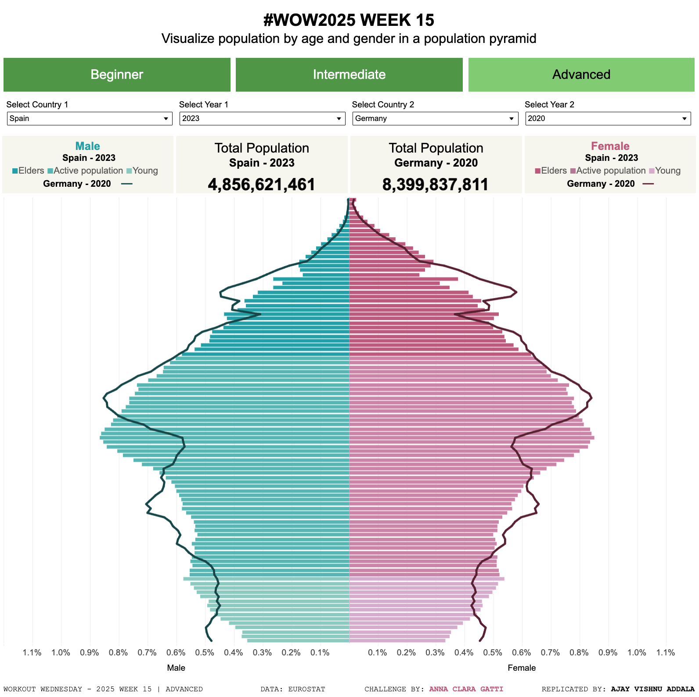

# Workout Wednesday 2025 | Week 15 | Community Month: Anna Clara Gatti

## Introduction
This repository contains my solution for **Workout Wednesday 2025 Week 15** challenge, created by **Anna Clara Gatti**. The challenge involves building a population pyramid dashboard using EUROSTAT data, allowing us to analyze the population structures of EU countries from 2015 to 2024. The challenge is divided into three levels of complexity.

---

## Project Overview

### Challenge Levels:
1. **Level 1 (Beginner):**
   - Dashboard size: 1000x1000.
   - Two sheets:
     - Population pyramid (two bar charts on the same y-axis).
     - Total population display.
   - Features:
     - Filter by country and year.
     - Symmetrical male/female axes.
     - Percentage and absolute values in tooltips.
     - Custom or default legend.
     - Colors:
       - Male: `#27aab0`.
       - Female: `#c46487`.

2. **Level 2 (Intermediate):**
   - Add age group colors:
     - Young (0-14): `#96d0c7` (males), `#dbb5d3` (females).
     - Active population (15-64): `#60bebc` (males), `#d18eb0` (females).
     - Elders (65+): `#27aab0` (males), `#c46487` (females).
   - Indicate age groups in tooltips.
   - Custom legend (non-repeating male/female).

3. **Level 3 (Advanced):**
   - Overlay line chart for comparison between two countries/years:
     - Male: `#175052`.
     - Female: `#632538`.
   - Additional sheet for the second country/year total population.
   - Detailed tooltips for both comparisons.
   - Navigation between multiple levels (e.g., using buttons).

---

## Solution

### Dashboard Features:
- **Filters:** Country and year selection.
- **Visualization Types:**
  - Population Pyramid with percentage and absolute values.
  - Line chart overlay for comparison.
  - Total population visualization for selected countries/years.
- **Design Choices:**
  - Symmetrical axes for gender.
  - Age group color coding.
  - Custom legends and navigation buttons.

### Tools Used:
- Tableau Desktop

### Dataset:
- Source: EUROSTAT (2015-2024 population data for EU countries).

---

## Screenshot

---

## Published Visualization
You can view the interactive dashboard on Tableau Public:

[

---

